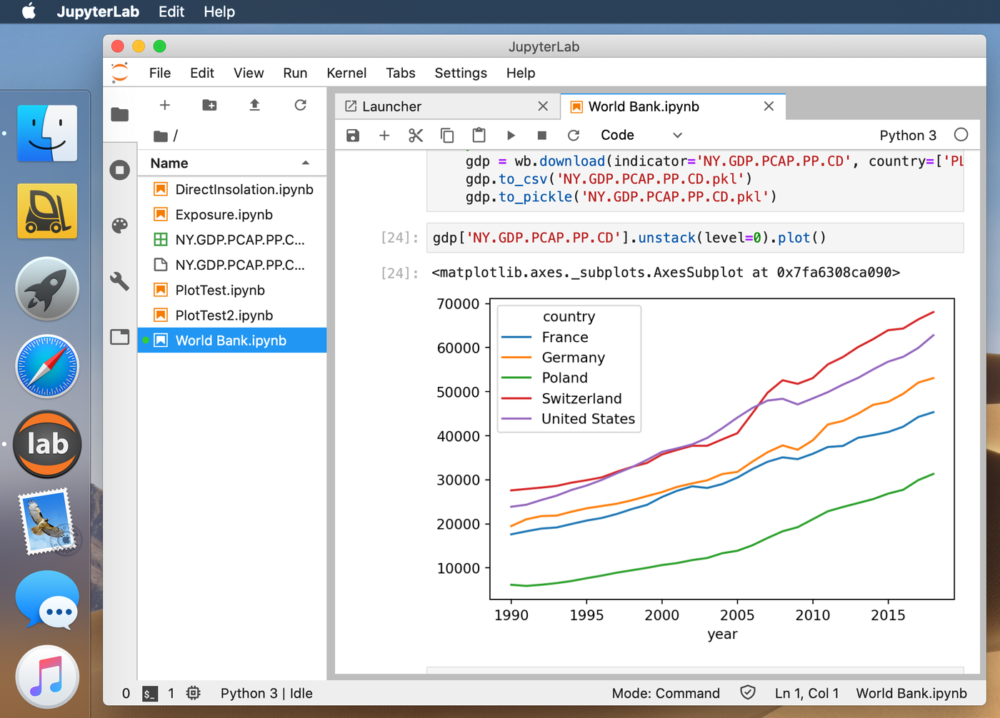

JupyterLab macOS Runner
=======================

[lab]: https://jupyterlab.readthedocs.io/en/stable/

This is a standalone application that runs `jupyter-lab` command in the background and opens a WebKit window with [*JupyterLab*][lab] interface. When the application is closed, background `jupyter-lab` process is terminated with `SIGTERM`.

It was created to make JupyterLab work more convenient on *macOS*, without the need to fiddle with the command line and making it distinctive from the regular browser.

NOTE: At the moment it does not detect if there are some unsaved notebooks upon application quit.

### Configuration

Accessible via `defaults read/write com.nanoant.webapp.JupyterLab`

This application has no dedicated settings UI. All settings needs to be adjusted using `defaults`. Following settings are exposed, showing default values:
~~~bash
defaults write com.nanoant.webapp.JupyterLab CommandPath  ~/miniconda3/bin/jupyter-lab
defaults write com.nanoant.webapp.JupyterLab NotebookPath ~/Documents/Notebooks
defaults write com.nanoant.webapp.JupyterLab Host "127.0.0.1" # local host address
defaults write com.nanoant.webapp.JupyterLab Port -int 0      # next available port
defaults write com.nanoant.webapp.JupyterLab Token "deadbeefb00b"
~~~

These settings are translated into following `jupyter-lab` invocation:
~~~bash
> $CommandPath \
    --no-browser \
    --ip=$Host \
    --port=$Port \
    --notebook-dir=$NotebookPath \
    --NotebookApp.token=$Token
~~~

### Build

Use CMake with Xcode or Command Line Tools installed to build it.

### License

Licensed under [MIT License](LICENSE).

### Disclaimers

Icon borrowed and revamped from [JupterLab][lab] project.
